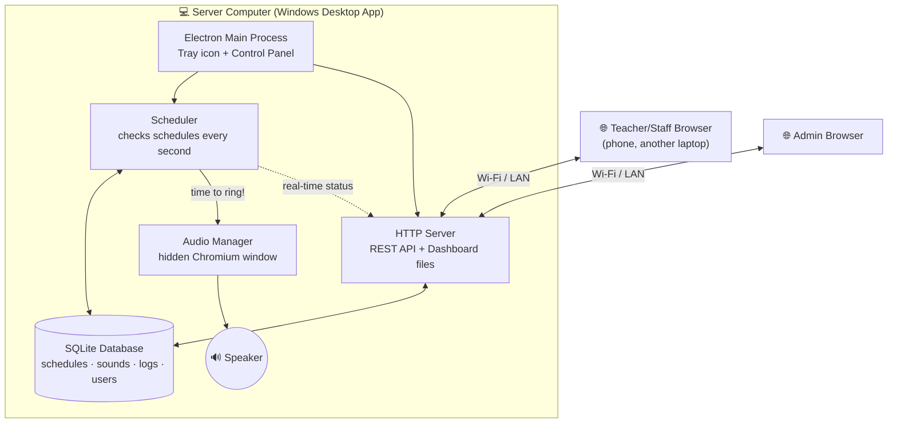
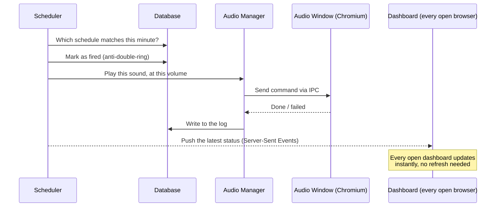

# 🔔 School Bell System

**Language:** [Indonesia](README.md) | English

An automated school bell application. A single Windows desktop app runs a **local
server** that schedules and rings bells automatically — right on time, with no browser
required to stay open — while also providing a **web dashboard** that can be accessed
from any other computer or phone on the same school network, to manage schedules,
sounds, and settings.

> Built with Electron + Node.js + SQLite. Runs entirely on the local network —
> **no internet connection required** for day-to-day operation.

## Table of Contents

- [Key Features](#-key-features)
- [How It Works](#-how-it-works)
- [Tech Stack](#-tech-stack)
- [Folder Structure](#-folder-structure)
- [For Users: Installation](#-for-users-installation)
- [For Developers: Building from Source](#-for-developers-building-from-source)
- [First Login](#-first-login)
- [Accessing the Dashboard from the School Network](#-accessing-the-dashboard-from-the-school-network)
- [Security](#-security)
- [Testing](#-testing)
- [Troubleshooting](#-troubleshooting)
- [License](#-license)

## ✨ Key Features

- **Accurate, restart-proof scheduling** — bell times are computed from the actual clock
  (not a timer that can drift). Restarting the app at exactly 07:29 still knows the next
  bell is at 07:30, and it will never ring twice.
- **Runs on the server, not in the browser** — bells keep ringing on time even if no
  dashboard is open on any computer or phone.
- **Real-time web dashboard** — a live clock, countdown to the next bell, and status that
  stays in sync across every device with the dashboard open (via Server-Sent Events).
- **Flexible schedule management** — recurring by day of week (e.g. Monday–Friday) or on
  a specific date, a different sound/volume per schedule, enable/disable without
  deleting, and JSON import/export of schedules.
- **Sound management** — drag-and-drop upload for MP3/WAV/OGG, in-browser preview,
  per-sound volume and maximum play duration.
- **Exam mode & temporary pause** — hold off automatic bells during exam periods or for
  short-notice needs, without touching the schedules themselves. Plus holiday date-range
  support.
- **User accounts & roles** — **Administrator** (full control) and **Viewer** (read-only)
  accounts, ideal for sharing access with duty teachers without risking accidental
  schedule changes.
- **Database backup & restore** — one click, plus automatic daily backups.
- **Full activity log** — every bell (rung / failed / missed / skipped due to a
  holiday-exam-pause) and every settings change is recorded with a timestamp and who did
  it.
- **Windows desktop app** — a system tray icon, a compact control panel, autostart on
  Windows login, and sleep prevention so bells are never missed.

## 🧠 How It Works

### Architecture Overview

School Bell System follows a **client–server** pattern — except the server runs on the
school's own computer (not on the internet). The desktop app (Electron) essentially
wraps an ordinary web server; the dashboard opened in a teacher's phone browser is just
a **client** talking to that server over a REST API and real-time events, exactly like
any regular web app.



Because the scheduler and server run **on the computer itself**, not in a browser tab,
closing the dashboard on every device has no effect whatsoever on the bell schedule —
bells keep ringing as long as the desktop app is running.

### The Scheduling Algorithm (the most important part)

A common mistake in homemade bell apps is using a single `setTimeout` computed once at
startup — it drifts over time, and is lost entirely if the app restarts. School Bell
System takes a different approach:

1. **A lightweight loop runs roughly every second**, aligned to the system clock's
   second boundary — not a separate timer per bell.
2. **Every "tick" is computed from the real clock** (`Date.now()`), not from how often
   the loop happens to run — so even if the computer briefly lags, the result stays
   accurate.
3. **Anti-double-ring**: every schedule that has already fired is marked with
   `"YYYY-MM-DD HH:MM"` in the database. Restarting within the same minute will not ring
   it again.
4. **Restart-proof**: the next bell is always recomputed from the schedule + the current
   time — never stored in memory alone. Restarting at 07:29 still knows the next bell is
   07:30.
5. **Late-tolerance (catch-up)**: if the computer only powers on 20 seconds after a
   scheduled time, the bell still rings. If it's later than the configurable tolerance
   (120 seconds by default) — e.g. the computer was off overnight — it's logged as
   "missed" instead of ringing late the next morning.

### What Happens When a Bell Rings



### Why Can It Be Reached From Another Phone?

The web server inside the app listens on every network interface of the computer
(`0.0.0.0`, not just `localhost`), so any other device connected to the same Wi-Fi/LAN
can open `http://SERVER-COMPUTER-IP:3000` in its browser — exactly like opening a home
router's admin page at `192.168.x.x`.

## 🛠 Tech Stack

| Part                | Technology                                                         |
|----------------------|----------------------------------------------------------------------|
| Desktop app           | [Electron](https://www.electronjs.org/)                             |
| Server / API            | [Node.js](https://nodejs.org/) + [Express](https://expressjs.com/)  |
| Database                  | `node:sqlite` — Node.js's **built-in** SQLite module (no native addon) |
| Web dashboard                | Plain HTML/CSS/JS (no framework, no build step)                  |
| Real-time updates               | Server-Sent Events (SSE)                                       |
| Authentication                     | Session cookies + **scrypt** password hashing                |
| Windows packaging                     | [electron-builder](https://www.electron.build/) (NSIS + portable) |
| Testing                                  | Node.js's built-in test runner (`node --test`)                |

> **Why `node:sqlite`?** Because it ships with Node.js itself (unlike a separate native
> addon such as `better-sqlite3`), building the `.exe` requires **no** Python or Visual
> Studio Build Tools at all — much simpler to maintain long-term.

## 📁 Folder Structure

```
school-bell/
├── desktop/          Electron app (main process, tray, control panel, audio player)
│   ├── main.js         Main process: BellApp, tray, windows, IPC, autostart
│   ├── preload.js       Secure IPC bridge for the control panel
│   ├── audioPlayer.js     Audio backend (hidden Chromium window)
│   ├── audio/               Audio player window's page & script
│   └── control/              Control panel UI (start/stop server, etc.)
│
├── server/           Core server — can run independently of Electron (headless mode)
│   ├── app.js           Main composition (BellApp): DB + scheduler + audio + HTTP
│   ├── scheduler/          Timestamp-based scheduling algorithm
│   ├── database/            SQLite layer (schema, migrations, queries)
│   ├── audio/                 AudioManager (queue, safety timeout)
│   ├── auth/                   Authentication, sessions, middleware
│   └── api/                     Every REST endpoint (schedules, sounds, logs, etc.)
│
├── frontend/         Web dashboard (vanilla-JS SPA, no build step)
│   ├── index.html
│   ├── css/style.css
│   └── js/pages/         One file per page (dashboard, schedules, sounds, logs, etc.)
│
├── default-sounds/   3 built-in sounds (copied automatically on first run)
├── scripts/          Helper scripts (default sound & icon generator)
├── test/             Automated tests (scheduler + every REST endpoint)
└── build/            electron-builder assets (the .exe icon)
```

While running, all **data** (database, uploaded sounds, logs, backups) is stored
**outside the installation folder** so it survives app updates:
`%APPDATA%\School Bell System\` on Windows — not inside Program Files.

## 📥 For Users: Installation

1. Download the installer from [Releases](../../releases) —
   `School Bell System Setup <version>.exe`.
2. Run the installer and follow the steps (choose an install folder if prompted).
3. Open the app from the Desktop/Start Menu — an icon will appear in the system tray.
4. Open `http://localhost:3000` in a browser, or click **"Open Dashboard"** in the app's
   control panel.
5. Log in with the default account (see [First Login](#-first-login)).

> Since the installer isn't signed with a paid certificate, Windows SmartScreen may show
> a "Windows protected your PC" warning the first time it runs. Click **"More info" →
> "Run anyway"** to continue.

## 👩‍💻 For Developers: Building from Source

Requires **Node.js 22.13+**.

```bash
git clone <this-repo-url>
cd school-bell
npm install
npm start                    # run as a desktop app (dev mode)
# or
npm run server                 # run ONLY the server, without Electron
```

Building the Windows installer:

```bash
npm run build:win-installer    # → dist/School Bell System Setup <version>.exe
npm run build:win-portable     # portable, no install needed → dist/SchoolBellSystem-Portable-<version>.exe
```

The build can be run from Windows, Mac, or Linux — the output is always for Windows.

## 🔑 First Login

```
Username: admin
Password: admin123
```

On first login, the system **requires** you to change the password before doing
anything else. After that, create additional accounts (Administrator/Viewer) from the
**System** page as needed — for example a Viewer account for a duty teacher who only
needs to see the day's schedule without being able to change it.

## 🌐 Accessing the Dashboard from the School Network

1. On the server computer, open the app's control panel to see the list of addresses
   (e.g. `http://192.168.1.20:3000`), or the **System → Dashboard Addresses** page on the
   web.
2. On a teacher's phone/laptop connected to the **same** school Wi-Fi, open that address.
3. Log in with the account that was created.

If it can't be reached from another device, check Windows Firewall — allow the app on
private networks (a permission dialog usually appears automatically the first time the
server starts).

## 🔒 Security

- Passwords are stored with **scrypt** hashing (never plaintext or a weak hash).
- Login sessions use `HttpOnly` + `SameSite=Lax` cookies, plus an `Origin` check to
  prevent CSRF.
- Failed login attempts are rate-limited (5 failures → locked for 5 minutes).
- Sound uploads are strictly validated: file extension, MIME type, **and** the file's
  binary signature (magic bytes) must all agree — not just the filename.
- Files are always renamed to a random, safe name on disk (the client's original
  filename is never trusted) to prevent path traversal.
- Standard security headers (`Content-Security-Policy`, `X-Frame-Options`, etc.) are
  active across the whole dashboard.

## 🧪 Testing

```bash
npm test
```

Covers: scheduler accuracy (restart, lateness, and database-failure simulations), and
every REST endpoint (authentication, input validation, sound upload, backup/restore,
etc.).

## 🩹 Troubleshooting

**A bell doesn't ring when it should**
Check the **Logs** page — every bell that failed, was missed, or was deliberately
skipped (holiday/exam/pause/disabled schedule) is always recorded along with the reason.

**The dashboard can't be reached from another phone/laptop**
Make sure both devices are on the **same** Wi-Fi/LAN, and check Windows Firewall (see
[Accessing the Dashboard](#-accessing-the-dashboard-from-the-school-network)).

**Bell timing is off after a power outage or restart**
No manual fix needed — the scheduler recomputes the next bell from the system clock as
soon as the app starts again (see [How It Works](#-how-it-works)). If Windows' own
**system** clock is wrong, use the **Sync System Time** button on the System page.

**Forgot the Administrator password**
Stop the app, move the database file at
`%APPDATA%\School Bell System\data\school-bell.db` somewhere else, then start the app
again — the default admin account (`admin`/`admin123`) will be recreated. This wipes all
schedules, so restore from the latest backup afterward if one exists (System page).

## 📄 License

Please adapt the `LICENSE` file to your needs (e.g. MIT) before publishing this
repository.

---

Built to help schools run a bell system they can actually rely on — no more paper
schedules taped to the wall, no more relying on someone to press a button every hour.
