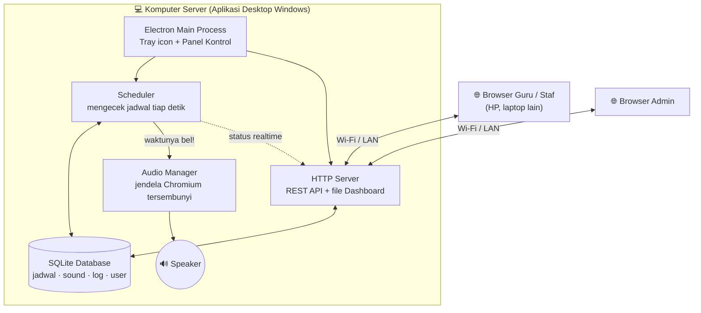
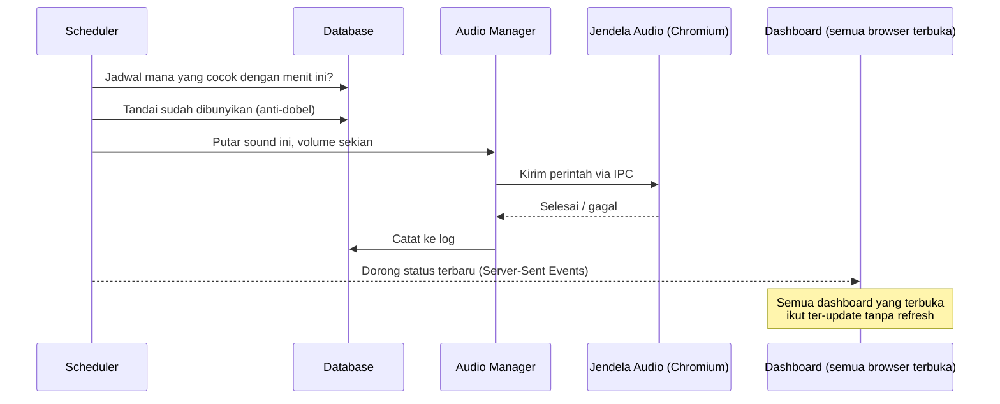

# 🔔 School Bell System

**Bahasa:** Indonesia | [English](README.en.md)

Aplikasi bel sekolah otomatis. Satu aplikasi desktop Windows menjalankan **server lokal**
yang menjadwalkan dan membunyikan bel secara otomatis — tepat waktu, tanpa perlu browser
tetap terbuka — sekaligus menyediakan **dashboard web** yang bisa diakses dari komputer
atau HP lain di jaringan sekolah yang sama untuk mengelola jadwal, sound, dan pengaturan.

> Dibangun dengan Electron + Node.js + SQLite. Berjalan sepenuhnya di jaringan lokal —
> **tidak butuh koneksi internet** untuk beroperasi sehari-hari.

## Daftar Isi

- [Fitur Utama](#-fitur-utama)
- [Cara Kerja](#-cara-kerja)
- [Teknologi yang Digunakan](#-teknologi-yang-digunakan)
- [Struktur Folder](#-struktur-folder)
- [Untuk Pengguna: Instalasi](#-untuk-pengguna-instalasi)
- [Untuk Developer: Build dari Source](#-untuk-developer-build-dari-source)
- [Login Pertama Kali](#-login-pertama-kali)
- [Mengakses Dashboard dari Jaringan Sekolah](#-mengakses-dashboard-dari-jaringan-sekolah)
- [Keamanan](#-keamanan)
- [Testing](#-testing)
- [Troubleshooting](#-troubleshooting)
- [Lisensi](#-lisensi)

## ✨ Fitur Utama

- **Penjadwalan akurat & tahan restart** — bel dihitung dari jam sebenarnya (bukan timer
  yang bisa meleset). Restart aplikasi tepat pukul 07:29 tetap tahu bel berikutnya adalah
  07:30, dan tidak akan berbunyi dua kali.
- **Berjalan di server, bukan di browser** — bel tetap berbunyi tepat waktu walau tidak
  ada dashboard yang sedang dibuka di komputer/HP mana pun.
- **Dashboard web real-time** — jam berjalan, hitung mundur ke bel berikutnya, dan status
  selalu sinkron di semua perangkat yang membuka dashboard secara bersamaan (via SSE).
- **Manajemen jadwal fleksibel** — berulang per hari (mis. Senin–Jumat) atau tanggal
  tertentu, sound & volume berbeda per jadwal, aktif/nonaktifkan tanpa menghapus, impor/
  ekspor jadwal sebagai berkas JSON.
- **Manajemen sound** — unggah MP3/WAV/OGG lewat drag-and-drop, preview langsung di
  browser, atur volume & batas durasi per sound.
- **Mode ujian & jeda sementara** — tahan bel otomatis untuk periode ujian atau kebutuhan
  mendadak, tanpa mengubah/menghapus jadwal. Plus dukungan hari libur (rentang tanggal).
- **Login & peran pengguna** — akun **Administrator** (kontrol penuh) dan **Viewer**
  (hanya melihat), cocok dibagikan ke guru piket tanpa risiko jadwal berubah.
- **Backup & restore database** — satu klik, plus backup otomatis harian.
- **Log lengkap** — setiap bel (berhasil/gagal/terlewat/dilewati karena libur-ujian-jeda)
  dan setiap perubahan pengaturan tercatat dengan waktu dan pelakunya.
- **Aplikasi desktop Windows** — ikon di system tray, panel kontrol ringkas, autostart
  saat Windows menyala, dan mencegah komputer sleep agar bel tidak terlewat.

## 🧠 Cara Kerja

### Gambaran Arsitektur

School Bell System memakai pola **client–server**, hanya saja server-nya berjalan di
komputer sekolah sendiri (bukan di internet). Aplikasi desktop (Electron) sebenarnya
membungkus sebuah server web biasa — dashboard yang dibuka di browser HP guru hanyalah
**klien** yang berbicara ke server itu lewat REST API + realtime event, persis seperti
aplikasi web pada umumnya.



Karena scheduler & server berjalan **di komputer**, bukan di tab browser, mematikan atau
menutup dashboard di semua perangkat sama sekali tidak memengaruhi jadwal bel — bel tetap
berbunyi selama aplikasi desktop menyala.

### Algoritma Penjadwalan (bagian paling penting)

Kesalahan umum aplikasi bel buatan sendiri adalah memakai `setTimeout` yang dihitung
sekali di awal — meleset sedikit demi sedikit, dan hilang total kalau aplikasi di-restart.
School Bell System memakai pendekatan berbeda:

1. **Loop ringan tiap ±1 detik**, disejajarkan ke pergantian detik jam sistem — bukan
   timer tunggal untuk tiap bel.
2. **Setiap "detak" dihitung dari jam sungguhan** (`Date.now()`), bukan dari seberapa
   sering loop-nya berjalan — jadi kalaupun komputer sempat lag, hasilnya tetap akurat.
3. **Anti-bunyi-dobel**: setiap jadwal yang sudah berbunyi ditandai `"YYYY-MM-DD HH:MM"`
   di database. Restart di menit yang sama tidak akan membunyikannya lagi.
4. **Tahan restart**: bel berikutnya selalu dihitung ulang dari jadwal + jam saat ini —
   bukan disimpan di memori. Restart pukul 07:29 tetap tahu bel berikutnya 07:30.
5. **Toleransi keterlambatan** (catch-up): kalau komputer baru menyala 20 detik setelah
   jadwal, bel tetap dibunyikan. Kalau lebih dari batas toleransi (bisa diatur, default
   120 detik) — misalnya komputer mati semalaman — dicatat sebagai "terlewat", bukan
   dibunyikan telat sekali di pagi hari berikutnya.

### Alur Saat Bel Berbunyi



### Kenapa Bisa Diakses dari HP Lain?

Web server di dalam aplikasi mendengarkan di semua antarmuka jaringan komputer
(`0.0.0.0`, bukan cuma `localhost`), jadi perangkat lain yang tersambung ke Wi-Fi/LAN yang
sama bisa membuka `http://IP-KOMPUTER-SERVER:3000` di browser mereka — persis seperti
membuka router Wi-Fi di rumah lewat `192.168.x.x`.

## 🛠 Teknologi yang Digunakan

| Bagian              | Teknologi                                                        |
|---------------------|-------------------------------------------------------------------|
| Aplikasi desktop     | [Electron](https://www.electronjs.org/)                          |
| Server / API         | [Node.js](https://nodejs.org/) + [Express](https://expressjs.com/) |
| Database              | `node:sqlite` — modul SQLite **bawaan** Node.js (tanpa native addon) |
| Dashboard web          | HTML/CSS/JS murni (tanpa framework, tanpa proses build)           |
| Realtime               | Server-Sent Events (SSE)                                          |
| Autentikasi            | Cookie session + hash password **scrypt**                         |
| Packaging Windows       | [electron-builder](https://www.electron.build/) (NSIS + portable) |
| Testing                  | Node.js built-in test runner (`node --test`)                     |

> **Kenapa `node:sqlite`?** Karena modul ini bawaan Node.js (bukan native addon terpisah
> seperti `better-sqlite3`), build `.exe`-nya **tidak memerlukan** Python atau Visual
> Studio Build Tools sama sekali — jauh lebih sederhana untuk di-maintain.

## 📁 Struktur Folder

```
school-bell/
├── desktop/          Aplikasi Electron (proses utama, tray, panel kontrol, pemutar audio)
│   ├── main.js         Proses utama: BellApp, tray, jendela, IPC, autostart
│   ├── preload.js       Jembatan IPC aman untuk panel kontrol
│   ├── audioPlayer.js     Backend audio (jendela Chromium tersembunyi)
│   ├── audio/               Halaman & script jendela pemutar audio
│   └── control/              UI panel kontrol (Start/Stop server, dsb.)
│
├── server/           Server inti — bisa jalan lepas dari Electron (mode headless)
│   ├── app.js           Komposisi utama (BellApp): DB + scheduler + audio + HTTP
│   ├── scheduler/          Algoritma penjadwalan berbasis timestamp
│   ├── database/            Lapisan SQLite (schema, migrasi, query)
│   ├── audio/                 AudioManager (antrian, timeout pengaman)
│   ├── auth/                   Autentikasi, sesi, middleware
│   └── api/                     Seluruh endpoint REST (schedules, sounds, logs, dst.)
│
├── frontend/         Dashboard web (SPA vanilla JS, tanpa build step)
│   ├── index.html
│   ├── css/style.css
│   └── js/pages/         Satu file per halaman (dashboard, jadwal, sound, logs, dst.)
│
├── default-sounds/   3 sound bawaan (disalin otomatis saat pertama kali dijalankan)
├── scripts/          Skrip bantu (generator sound & ikon bawaan)
├── test/             Automated test (scheduler + seluruh REST API)
└── build/            Aset untuk electron-builder (ikon .exe)
```

Saat aplikasi berjalan, **data** (database, sound yang diunggah, log, backup) disimpan
**di luar folder instalasi** supaya aman saat aplikasi di-update:
`%APPDATA%\School Bell System\` (Windows) — bukan di folder Program Files.

## 📥 Untuk Pengguna: Instalasi

1. Unduh installer dari [Releases](../../releases) — `School Bell System Setup <versi>.exe`.
2. Jalankan installer, ikuti langkah-langkahnya (pilih folder instalasi bila diminta).
3. Buka aplikasi dari Desktop/Start Menu — ikon akan muncul di system tray.
4. Buka `http://localhost:3000` di browser, atau klik **"Buka Dashboard"** di panel
   kontrol aplikasi.
5. Login dengan akun bawaan (lihat [Login Pertama Kali](#-login-pertama-kali)).

> Karena installer belum ditandatangani dengan sertifikat berbayar, Windows SmartScreen
> mungkin menampilkan peringatan "Windows protected your PC" saat pertama dijalankan.
> Klik **"More info" → "Run anyway"** untuk melanjutkan.

## 👩‍💻 Untuk Developer: Build dari Source

Kebutuhan: **Node.js 22.13+**.

```bash
git clone <url-repo-ini>
cd school-bell
npm install
npm start                    # jalankan sebagai aplikasi desktop (mode dev)
# atau
npm run server                 # jalankan HANYA server, tanpa Electron
```

Build installer Windows:

```bash
npm run build:win-installer    # → dist/School Bell System Setup <versi>.exe
npm run build:win-portable     # versi tanpa instalasi → dist/SchoolBellSystem-Portable-<versi>.exe
```

Build bisa dilakukan dari Windows, Mac, maupun Linux — hasilnya tetap untuk Windows.

## 🔑 Login Pertama Kali

```
Username : admin
Password : admin123
```

Saat login pertama, sistem **mewajibkan** ganti password sebelum bisa melakukan apa pun.
Setelah itu, buat akun tambahan (Administrator/Viewer) di menu **System** sesuai
kebutuhan — misalnya akun Viewer untuk guru piket yang hanya perlu melihat jadwal tanpa
bisa mengubahnya.

## 🌐 Mengakses Dashboard dari Jaringan Sekolah

1. Di komputer server, buka panel kontrol aplikasi → lihat daftar alamat (mis.
   `http://192.168.1.20:3000`), atau menu **System → Alamat Dashboard** di web.
2. Di HP/laptop guru yang terhubung ke Wi-Fi sekolah **yang sama**, buka alamat tersebut.
3. Login dengan akun yang sudah dibuat.

Bila tidak bisa diakses dari perangkat lain, periksa Windows Firewall — izinkan aplikasi
untuk jaringan privat (biasanya muncul dialog izin otomatis saat server pertama kali
dijalankan).

## 🔒 Keamanan

- Password disimpan dengan hash **scrypt** (bukan plaintext/hash lemah).
- Sesi login dengan cookie `HttpOnly` + `SameSite=Lax`, plus pemeriksaan `Origin` untuk
  mencegah CSRF.
- Percobaan login gagal dibatasi (5 kali → terkunci 5 menit).
- Upload sound divalidasi ketat: ekstensi, tipe MIME, **dan** tanda tangan biner berkas
  (magic bytes) harus konsisten — bukan hanya cek nama berkas.
- Nama berkas di server selalu dibuat ulang secara acak (tidak pernah memakai nama asli
  dari pengguna) untuk mencegah path traversal.
- Header keamanan standar (`Content-Security-Policy`, `X-Frame-Options`, dll.) aktif di
  seluruh dashboard.

## 🧪 Testing

```bash
npm test
```

Mencakup: akurasi scheduler (simulasi restart, keterlambatan, kegagalan database), dan
seluruh endpoint API (autentikasi, validasi input, upload sound, backup/restore, dsb).

## 🩹 Troubleshooting

**Bel tidak berbunyi di jam yang seharusnya**
Periksa menu **Logs** — setiap bel yang gagal, terlewat, atau sengaja dilewati (libur/
ujian/jeda/jadwal nonaktif) selalu tercatat beserta alasannya.

**Dashboard tidak bisa diakses dari HP/laptop lain**
Pastikan kedua perangkat berada di jaringan Wi-Fi/LAN yang **sama**, dan periksa Windows
Firewall (lihat bagian [Mengakses Dashboard](#-mengakses-dashboard-dari-jaringan-sekolah)).

**Jam bel meleset setelah komputer mati listrik/restart**
Tidak perlu diatur manual — scheduler menghitung ulang bel berikutnya dari jam sistem
saat aplikasi menyala kembali (lihat [Cara Kerja](#-cara-kerja)). Jika jam **sistem**
Windows sendiri yang salah, gunakan tombol **Sinkronkan Waktu Sistem** di menu System.

**Lupa password Administrator**
Hentikan aplikasi, pindahkan berkas database di
`%APPDATA%\School Bell System\data\school-bell.db` ke folder lain, lalu jalankan ulang —
akun admin bawaan (`admin`/`admin123`) akan dibuat ulang. Ini menghapus seluruh jadwal;
restore dari backup terbaru setelahnya jika ada (menu System).

## 📄 Lisensi

Proyek ini dilisensikan di bawah [MIT License](LICENSE) — bebas dipakai, diubah, dan
didistribusikan ulang, termasuk untuk keperluan komersial, selama menyertakan notice
lisensi aslinya. Ganti

---

Dibuat untuk membantu sekolah menjalankan bel otomatis yang bisa diandalkan — tanpa
tempelan jadwal kertas, tanpa harus ada orang yang menekan tombol setiap jam.
